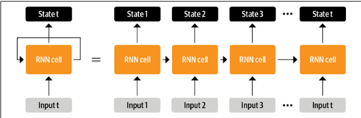
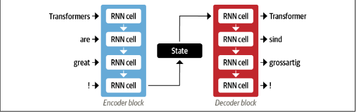
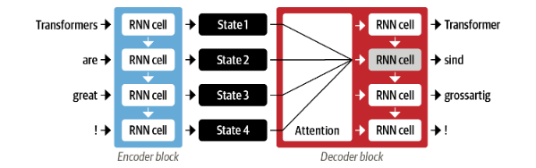
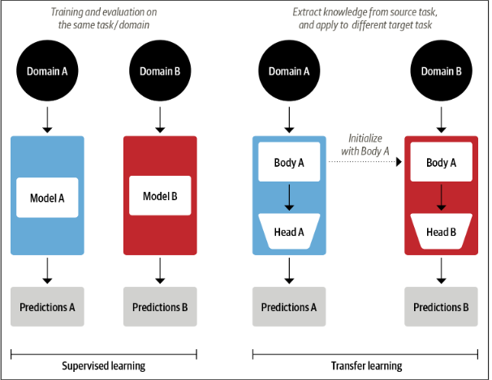

RNN unrolling:

- RNNs have played a key role in machine translation systems by employing an encoder-decoder architecture to convert input sequences into numerical representations and generate corresponding output sequences.

encoder-decoder architecture with two RNNs:

- attention: decoder may have access to all of encoder's hidden states

encoder-decoder architecture with an attention mechanism for a pair of RNNs:

supervised vs transfer learning:

